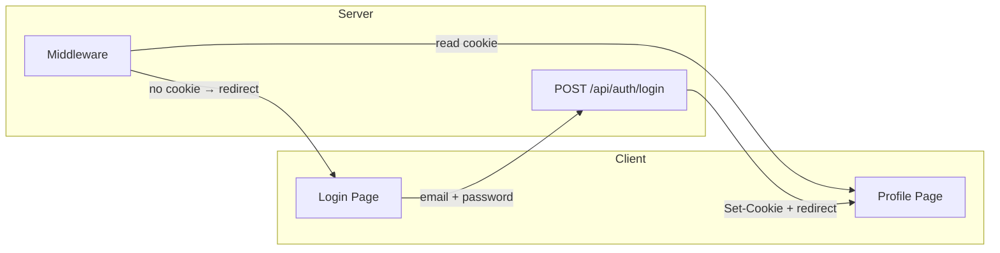
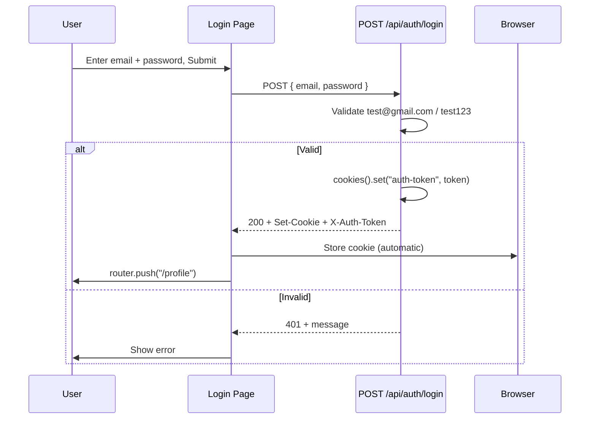
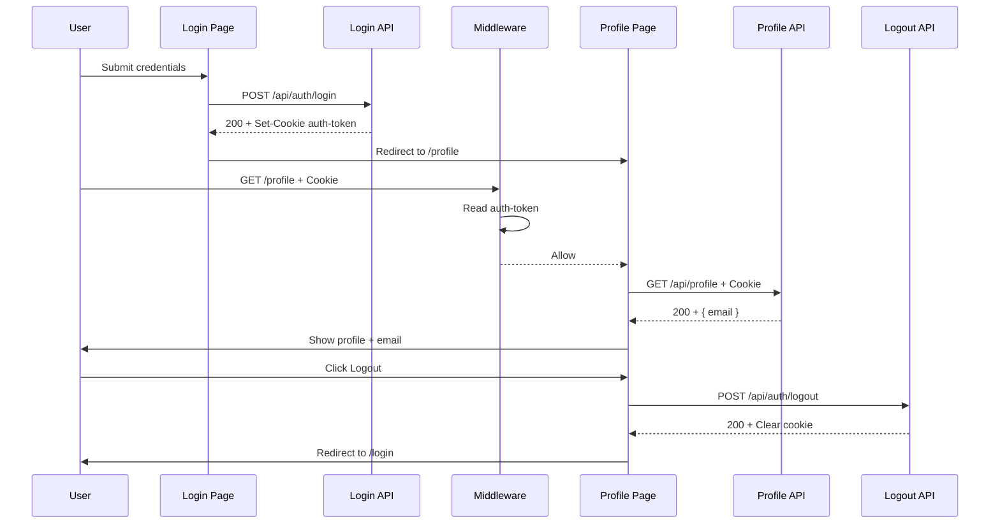

# login-with-cookie

A Next.js app with **cookie-based authentication**: Login and Profile pages, mock email/password auth, and protected routes using an HTTP-only cookie.

## Description

This project demonstrates **cookie-based session auth** in the App Router. The server sets an HTTP-only cookie (`auth-token`) on successful login; the browser stores it automatically and sends it with every request. Middleware reads the cookie to protect `/profile` and redirect unauthenticated users to `/login`. The Profile page calls GET `/api/profile` (which also reads the cookie) to show the current user. No token is stored in `localStorage` or in client-side state—only in the cookie, so it is not exposed to JavaScript and is sent only to the same origin.

## Features

- **Login** (`/login`) — Email/password form; mock credentials only.
- **Profile** (`/profile`) — Protected route; shows user email from API and Logout.
- **Home** (`/`) — Redirects to `/profile` if logged in, else `/login`.
- **Cookie strategy** — Token stored in HTTP-only cookie `auth-token`; middleware protects routes; token also returned in response headers on login.

## Mock credentials

| Email           | Password |
|----------------|----------|
| test@gmail.com | test123  |

## Getting started

```bash
npm install
npm run dev
```

Open [http://localhost:3000](http://localhost:3000). You’ll be redirected to `/login`; sign in with the mock credentials above, then you’re redirected to `/profile`.

## Project structure

```
app/
  page.tsx              # Home: redirect to /login or /profile
  login/page.tsx        # Login form → POST /api/auth/login
  profile/page.tsx      # Protected; fetches GET /api/profile, Logout
  api/
    auth/login/route.ts # POST: validate credentials, set cookie, return token in headers
    auth/logout/route.ts# POST: clear auth cookie
    profile/route.ts    # GET: return user (e.g. email) if cookie present; 401 otherwise
middleware.ts           # Protect /profile; redirect /login → /profile when logged in
```

## API routes

| Method | Route              | Description |
|--------|--------------------|-------------|
| POST   | `/api/auth/login`  | Body: `{ email, password }`. Success: sets `auth-token` cookie, returns `{ success: true }` and token in `X-Auth-Token` / `Authorization` headers. Failure: 401. |
| POST   | `/api/auth/logout` | Clears `auth-token` cookie; returns `{ success: true }`. |
| GET    | `/api/profile`    | Requires `auth-token` cookie. Returns `{ email: "test@gmail.com" }` or 401. |

## How the cookie works

1. **Login** — On valid credentials, the login API calls `cookies().set("auth-token", token, { httpOnly, secure, sameSite: "lax", path: "/", maxAge: 24h })`. The response includes a `Set-Cookie` header; the **browser** stores the cookie automatically (no client-side code needed).
2. **Later requests** — The browser sends `Cookie: auth-token=...` on every request to the same origin.
3. **Middleware** — Reads `request.cookies.get("auth-token")`. No token on `/profile` → redirect to `/login`. Token on `/login` → redirect to `/profile`.
4. **GET /api/profile** — Reads the cookie via `cookies().get("auth-token")`; missing or invalid → 401.
5. **Logout** — Logout API sets `auth-token` to `""` with `maxAge: 0`; the browser removes the cookie.

The cookie is **httpOnly**, so JavaScript cannot read it; only the server sees it. The login response still includes the token in headers (`X-Auth-Token`, `Authorization`) if you need it once on the client.

### Diagrams

**Architecture (cookie flow between client and server):**



**Login flow (how the cookie is set and stored automatically):**



**Full flow (login → profile → logout):**



## Scripts

- `npm run dev` — Start development server.
- `npm run build` — Production build.
- `npm run start` — Start production server.
- `npm run lint` — Run ESLint.

## Deploy

You can deploy with [Vercel](https://vercel.com/new) or any platform that supports Next.js. Use HTTPS in production so the `secure` cookie flag works.
